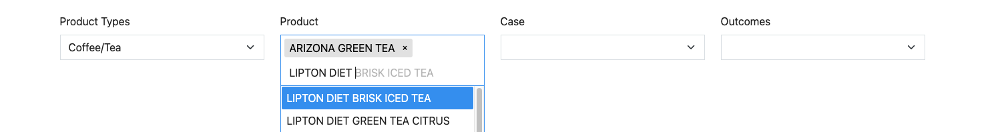

# Tagify Input Component
[Tagify](https://github.com/yairEO/tagify) offers a handy component for selecting multiple items via search from a large list of options. In this component we connect our Harness-Vue filter data to this component to allow for the Tagify tagging component to be used in conjunction with the Harness-Vue state flow.


[[toc]]


## Example Use Case

This component is particularly useful when a user must choose multiple options from a list that is too large to scroll through. Consider a scenario, where a user must select from a large list of individual product options. The Tagify component allows the user to quickly search and select multiple products of interest for data visualization.



## Connecting to Harness-Vue State


As discussed in the [Filter Components]() section, any custom input controlling a Harness-Vue filter must be able to both retrieve and update the current value of the filter.

This component utilizes the `onMounted` lifecycle hook to initialize the Tagify input with the current state of the Harness-Vue filter. The component initializes a watcher on the filter options, updating the Tagify input's suggested options (whitelist). This setup allows the suggestion options to be dynamically updated based on changes to another filter.

Additionally, the component establishes event listeners for the add and remove events of the Tagify input. Any addition or removal of a tag triggers an update to the Harness-Vue filter and a subsequent data reload.

## Component Code
```vue
/**
 * @typedef {Object} Props
 * @property {Object} filter - The filter object used for data filtering.
 * @property {String} inputDescription - The description of the input field.
 * @property {String} label - The label for the input field.
 */
<script setup>
import { useHarnessComposable } from "@rtidatascience/harness-vue";
import { onMounted, watch, ref } from "vue";
import { arraysAreEqual } from "@/utils/util";
import Tagify from "@yaireo/tagify";

/**
 * The harness composable instance.
 */
const harness = useHarnessComposable();

/**
 * The component props.
 * @type {Props}
 */
const props = defineProps({
  filter: {
    required: true,
    type: Object,
    validator: (f) => f.key,
  },
  inputDescription: {
    required: true,
    type: String,
  },
  label: {
    type: String,
    required: true,
  },
});

/**
 * The reference to the tagify input element.
 */
const tagifyInput = ref(null);

/**
 * Lifecycle hook that runs after the component is mounted.
 */
onMounted(async () => {
  // Initialize tagify
  var whitelist = [];

  var tagify = new Tagify(tagifyInput.value, {
    whitelist: whitelist,
    enforceWhitelist: true,
    dropdown: {
      enabled: 0,
      maxItems: Infinity,
    },
  });

  /**
   * Watcher for changes in the filter options.
   */
  watch(
    () => harness.getOptionsForFilter(props.filter.key),
    (newVal, oldVal) => {
      if (
        !arraysAreEqual(
          newVal.map((item) => item.key),
          oldVal.map((item) => item.key),
        )
      ) {
        // Remove current tags
        tagify.removeAllTags();
        // Convert the array of objects to an array of strings
        var stringTags = newVal
          .map((item) => item.label)
          .sort((a, b) => a.toLowerCase().localeCompare(b.toLowerCase()));
        whitelist = stringTags;
        tagify.settings.whitelist = stringTags;
      }
    },
  );

  // Chainable event listeners
  tagify.on("add", onAddTag).on("remove", onRemoveTag);

  /**
   * Callback function for when a tag is added.
   * @param {Event} _e - The event object.
   */
  function onAddTag(_e) {
    // Update Harness filter
    updateFilter();
  }

  /**
   * Callback function for when a tag is removed.
   * @param {Event} _e - The event object.
   */
  function onRemoveTag(_e) {
    updateFilter();
  }

  /**
   * Updates the Harness filter based on the selected tags.
   */
  function updateFilter() {
    // Update Harness filter
    const options = harness.getOptionsForFilter(props.filter.key);
    const keys = tagify.value
      .map((value) => {
        const option = options.find((item) => item.label === value.value);
        return option ? option.key : null;
      })
      .filter((key) => key !== null);
    harness.setFilter(props.filter.key, keys);
    harness.loadData();
  }
});
</script>

<template>
  <div class="col" id="tagify-col">
    <div class="form-group">
      <label for="tagifyInput" class="form-label">{{ label }}</label>
      <input
        class="form-control"
        id="tagifyInput"
        ref="tagifyInput"
        aria-describedby="tagifyInputHelpBlock"
      />
      <small
        id="tagifyInputHelpBlock"
        class="form-text text-muted"
        v-html="props.inputDescription"
      ></small>
    </div>
  </div>
</template>
```